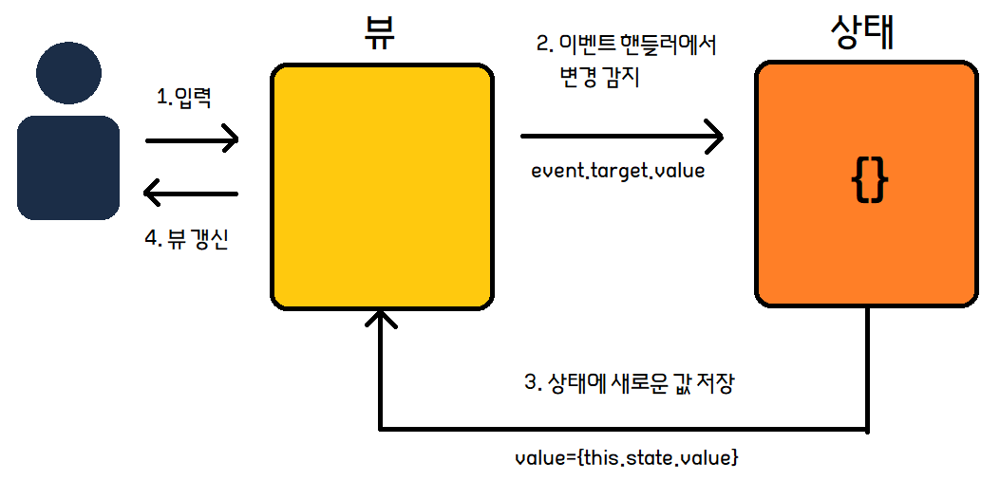

# React에서 Form 요소를 통한 입력 처리


> React 컴포넌트는 초기화 시점은 물론 어느 시점에든지 뷰의 상태를 표현해야 한다. - React 공식 문서


```react
render() {
    return <input type="text" name="title" value="Mr. "/>
}
```

* input 영역 값이 항상 Mr. 로 유지되는 코드

  * 입력은 사용자 입력에 따라 변경되어야 한다. -> 따라서 상태에 따라 일력 값 갱신하도록 구현

    

```react
render() {
    return <input type="text" name="title" value={this.state.title}/>
}
```

* 상태가 변경되고 있다는걸 React가 감지 할 수 있도록 onChange에 이벤트 핸들러를 추가.

  

```react
handleChange(event) {
    this.setState({title: event.target.value})
}
render() {
    return <input type="text" name="title" value={this.state.title}/>
}
```



> 상태가 뷰를 갱신하는 **단방향 바인딩**


## 🟦 제어 컴포넌트


> React에서 권장하는 컴포넌트 내부 상태와 뷰를 항상 동기화 시키는 방법


### 💻 폼과 이벤트 정의하기


> `<form>` 이란?
>
> input 요소를 공통 목적을 가진 항목끼리 묶어서` <form>` 요소로 감싼다.


#### `<form>` 요소에 사용 가능한 이벤트

* React DOM 이벤트
  * 마우스 이벤트, 키보드 이벤트
* 폼 요소를 위한 세가지 이벤트
  * onChange
    * 폼의 입력 요소에 변경이 생기면 발생한다.
  * onInput
    * `<textarea>,<input>` 요소의 값이 변경될 때 발생한다. React에서 사용하지 않기를 권장한다.
  * onSubmit
    * 폼 제출 시 발생한다.


#### submit 제출시 이벤트 등록


```react
handleSubmit(event) {
    ...
}
    
render() {
    return <form onSubmit={this.handleSubmit}>
    	<input type="text" name="email" />
    </form>      
}
```


### 💻 폼 요소 정의하기

> React에서는 속성을 변경할 수 없다.
>
> 단, 폼 요소는 사용자가 폼 요소와 상호작용하면서 속성을 변경하므로 특별한 경우다.


#### React의 변경 가능한 속성

* 대화형 속성

  * value
    * `<input>, <textarea>, <select>`에 적용된다.

  * checked
    * `<input>`의 타입이 checkbox, radio인 경우 적용된다.

  * selected
    * `<select>` 와 함께 `<option>`을 사용할 때 적용된다.


#### ✅ `<input>` 요소

* 주요 타입
  * text
  * password
  * radio
  * checkbox
  * button

> input  요소의 주요 용도는 대화형 속성을 사용하여 요소의 속성을 변경하는 것이다.
>
> value를 변경 가능한 값으로 사용하지 않는 예외 2가지
>
> * checkbox
> * radio
>
> 대신, checked 또는 selected 속성이 변경된다.


#### ✅ `<textarea> ` 요소


일반적인 HTML의 경우...

```html
<textarea>
	...
</textarea>
```

* innerHTML을 사용하여 값을 보여준다.


**그러나 React는 다르다**

```react
render() {
    return <textarea name="description" value={this.state.decription}/>
}
```

* value 속성을 사용한다.

  

> 어?? innerHTML로 값을 설정해도 되는데요?!?
>
> * `<textarea>` 에 자식이 있는 경우에는 자식으로 입력된 텍스트를 기본값으로 사용한다.


#### ✅ `<select>,<option> ` 요소


* 선택된 요소의 순서 확인

  * 일반 HTML은 selectDOMNode.selectedIndex를 사용한다.

  ```js
  const showValue = (target) => {
    // 선택한 option의 value 값
    console.log(target.value);
    
    // option의 text 값
    console.log(target.options[target.selectedIndex].text);
  }
  ```

  

  * React의 경우, select에 value속성을 사용한다.

  ```react
  class Content extends React.Component {
      constructor(props) {
          super(props)
          this.state = {
              selectedValue: 'node'
          }
      }
      handleSelectChange(event) {
          this.setState({selectedValue: event.target.value})
      }
      
      render() {
          return <form>
          	<select
                  value={this.state.selectedValue}
                  onChange={this.handleSelectChange}>
                  	<option value="ruby">Ruby</option>
                      <option value="node">Node</option>
                      <option value="Python">Python</option>
              </select>
          </form>
      }
  }
  ```

  

## 변경 감지하기


> 폼 요소의 변경을 감지할 때는 onChange 이벤트리스너를 이용한다.


#### HTML의 onchange

* 요소가 포커스를 잃었을 때 발생

  

#### React의 onchange

* **모든 새로운 입력에 대해 발생**
  * `<input>, <textarea>, <select>` : value가 변경될 때 onChange 이벤트가 발생
  * 체크박스와 라디오 버튼: checked가 변경될 때 onChange 이벤트가 발생


### 변경을 감지하려면?

:one: 컴포넌트에 이벤트 핸들러를 정의하고

:two: onChange 속성으로 이벤트 핸들러를 전달

```react
handleChange(event) {
    console.log(event.target.value)
}
render() {
    return <input
       type="text"
       onChange={this.handleChange}
       defaultValue="erict4f@naver.com"/>
}
```

❗ onChange를 정의하지 않고 value만 입력하면 React가 경고를 보내고 읽기 전용으로 만든다.

만약... 의도적으로 읽기 전용으로 만들고 싶다면 readOnly 속성을 추가할것.

