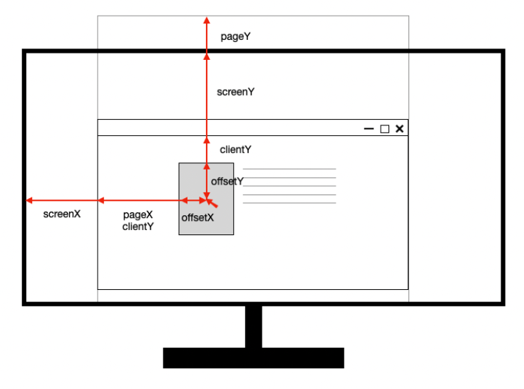

## 마우스를 따라 움직이는 아이콘 만들기


### 마우스의 좌표

마우스 이벤트가 지원하는 좌표 종류 네가지

- screenX/Y : 모니터 화면 기준
- clientX/Y : 웹페이지가 보여지는 영역 기준 (스크롤 시 값이 변하지 않음)
- pageX/Y : 전체 문서 기준 (스크롤 시 값이 변함)
- offsetX/Y : 좌표를 출력하도록 하는 이벤트가 걸려있는 DOM node 기준





### requestAnimationFrame

자바스크립트에서 애니메이션을 구현할 때, 전통적인 방식은 `setInterval`을 사용한다. 간격을 정해두고 연속으로 함수를 호출하여 애니메이션을 만든다. 이는 프레임을 신경쓰지 않고 동작하기 때문에 뚝뚝 끊기는 현상이 일어날 수 있다. 

`requestAnimationFrame`은 이를 개선한 함수이다.

`setInterval`과는 달리 콜백 함수의 호출 시간간격이나 지속시간을 인자로 따로 받지 않고 모니터의 주사율에 따른다! 60Hz의 모니터면 1초에 60번, 144Hz면 1초에 144번 호출된다. 또한 백그라운드 동작 및 비활성화시 중지 애니메이션이 중지되기 때문에 성능 최적화도 가능하다.

`requestAnimationFrame` 은 인자로 다음 렌더링에서 호출할 콜백함수를 받고, 그 다음 프레임을 애니메이트 하려면 콜백 루틴이 스스로 `requestAnimationFrame()`을 호출하여야 한다.

`requestAnimationFrame()`은 고유한 요청 id를 반환하며 이 값을 `cancelAnimationFrame()`에 전달하여 요청을 취소할 수 있다.


```html
<!DOCTYPE html>
<html lang="en">
<head>
  <meta charset="UTF-8">
  <meta http-equiv="X-UA-Compatible" content="IE=edge">
  <meta name="viewport" content="width=device-width, initial-scale=1.0">
  <title>Document</title>
  <style>
    
    @keyframes gradient-color {
      0% {
        fill: yellow;
      }
      50% {
        fill: pink;
      }
      100% {
        fill: blue;
      }
    }

    svg {
      position: absolute;
      top: 0;
      right: 0;
      bottom: 0;
      left: 0;
      width: 100px;
      height: 100px;
      margin: auto;
    }

    .little-star {
      animation: gradient-color 1s infinite alternate linear;
    }

  </style>
</head>
<body>

  <svg id="레이어_1" data-name="레이어 1" xmlns="http://www.w3.org/2000/svg" viewBox="0 0 254.16 191.34">
    <defs>
      <style>
        .cls-1 {
          fill: #f8b62d;
        }
      </style>
    </defs>
    <polygon class="cls-1" points="160.24 185.73 99.2 154.68 39.02 187.37 49.68 119.72 0 72.58 67.64 61.82 97.11 0 128.25 61 196.15 69.93 147.76 118.39 160.24 185.73"/>
    <polygon class="cls-1 little-star" points="254.16 160.51 227.27 166.05 216.59 191.34 203.01 167.49 175.66 165.15 194.16 144.86 187.93 118.12 212.94 129.44 236.44 115.26 233.4 142.54 254.16 160.51"/>
  </svg>

  <script>
    (() => {
    const icon = document.querySelector('svg');
    const mouseClientPos = { x: 0, y: 0 };
    const targetPos = { x: 0, y: 0 }
    const iconInfo = { x: 0, y: 0 };
    const easeValue = 0.05;
    
    window.addEventListener('mousemove', (e) => {
      mouseClientPos.x = e.clientX
      mouseClientPos.y = e.clientY
      targetPos.x = e.pageX - window.innerWidth * 0.5;
      targetPos.y = e.pageY - window.innerHeight * 0.5;
    });

    window.addEventListener('scroll', (e) => {
      targetPos.y = window.scrollY + mouseClientPos.y - window.innerHeight * 0.5;
    });

    let dx;
    let dy;
    function render() {
      dx = targetPos.x - iconInfo.x;
      dy = targetPos.y - iconInfo.y;
      iconInfo.x = iconInfo.x + dx * easeValue;
      iconInfo.y = iconInfo.y + dy * easeValue;
      icon.style.transform = `translate(${iconInfo.x}px, ${iconInfo.y}px)`;
      requestAnimationFrame(render);
    }

    render();      
 //   setInterval(render, 20);
    })();
  </script>
  
</body>
</html>
```


참고링크

- https://developer.mozilla.org/ko/docs/Web/API/MouseEvent
- https://ko.javascript.info/mouse-events-basics#ref-780
- https://velog.io/@klloo/JavaScript-%EB%A7%88%EC%9A%B0%EC%8A%A4-%ED%8F%AC%EC%9D%B8%ED%84%B0-%EC%A2%8C%ED%91%9Cscreen-page-client-offset
- https://developer.mozilla.org/ko/docs/Web/API/Window/requestAnimationFrame
- [마우스 포인터 효과들 모아놓은 블로그](https://blog.naver.com/PostView.nhn?isHttpsRedirect=true&blogId=loveful&logNo=221483117853&parentCategoryNo=8&categoryNo=&viewDate=&isShowPopularPosts=true&from=search)
- [Window객체/Document객체](http://www.tcpschool.com/javascript/js_bom_window)
- https://velog.io/@0715yk/HTML-requestAnimationFrame